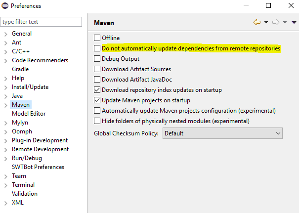

# Augmented Things
This is a Maven project containing the source and configuration files needed by AT. In order for the application to work, be sure to have installed om2m on your hosts: see the [om2m installation procedure](https://people.unipi.it/giacomo_tanganelli/teaching/om2m/om2m-installation/) for more information.

## Documentation
https://goo.gl/xUq2DM

## Build project
On Linux, run
```
git clone https://github.com/openformatproj/augmented-things.git
```
then, from the parent directory, execute
```
mvn clean compile assembly:single
```
to produce the final .jar files (see [```om2m/README.md/Setting```](https://github.com/openformatproj/augmented-things/blob/master/augmented-things/om2m/README.md#setting) for configuration and [```om2m/README.md/Executing nodes```](https://github.com/openformatproj/augmented-things/blob/master/augmented-things/om2m/README.md#executing-nodes) for usage information), and
```
mvn clean compile war:war
```
to do the same for .war files.

## Notes for collaborators
To import this project in your Eclipse workspace
* right click on Package Explorer -> Import -> Maven/Check out Maven Projects from SCM or File -> Import -> Maven/Check out Maven Projects
* put in the SCM URL field the following address ```git@github.com:openformatproj/augmented-things.git``` (be sure to have the EGit SCM connector installed)
* click Finish

**Note**: on some Eclipse versions, such as Eclipse Oxygen, it may be necessary to set Maven options as follows



it seems that Photon doesn't require this.

### Github synchronization
To synchronize your local copy with the current version of this repository
* right click on Package Explorer/augmented-things -> Team -> Pull

to push your edit in this repository
* right click on Package Explorer/augmented-things -> Team -> Commit -> Commit and Push

### Modules' documentation
Also check
* [```om2m/README.md```](https://github.com/openformatproj/augmented-things/blob/master/augmented-things/om2m/README.md)
* [```om2m/asn/factory/README.md```](https://github.com/openformatproj/augmented-things/tree/master/augmented-things/om2m/asn/factory/README.md)
* [```web/README.md```](https://github.com/openformatproj/augmented-things/blob/master/augmented-things/web/README.md)
* [Contiki simulation](https://drive.google.com/drive/folders/1UCtUQH555_K1cqXqpyiYsh_Y-ocA-PP3)
